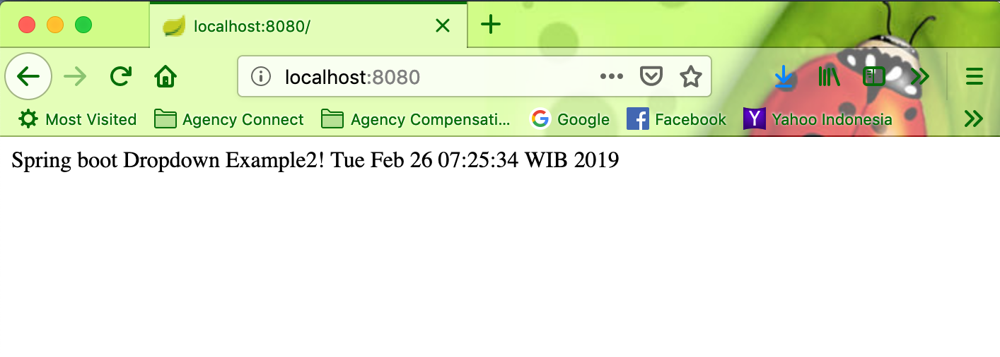
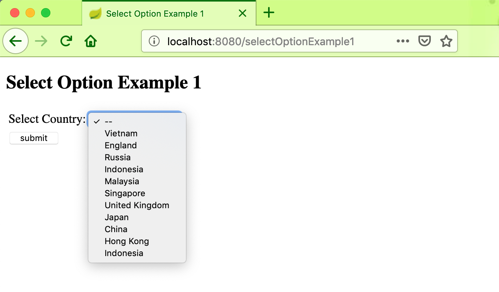
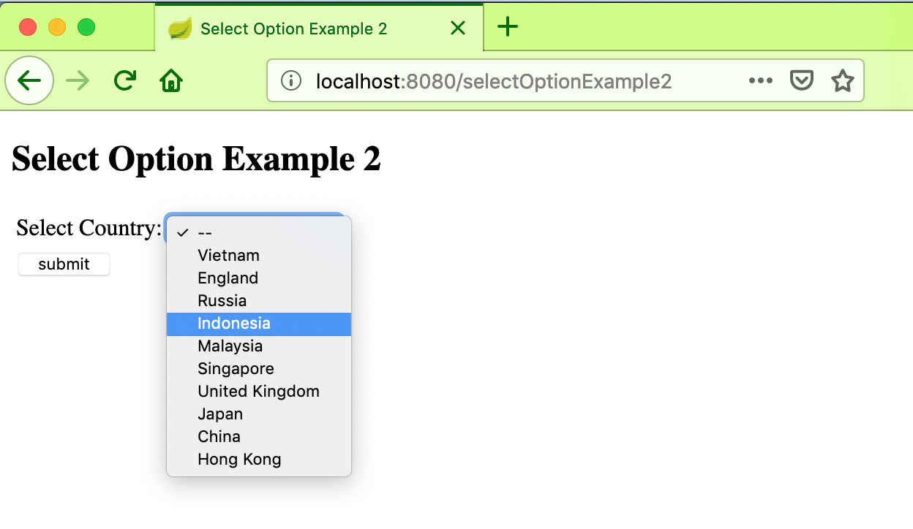
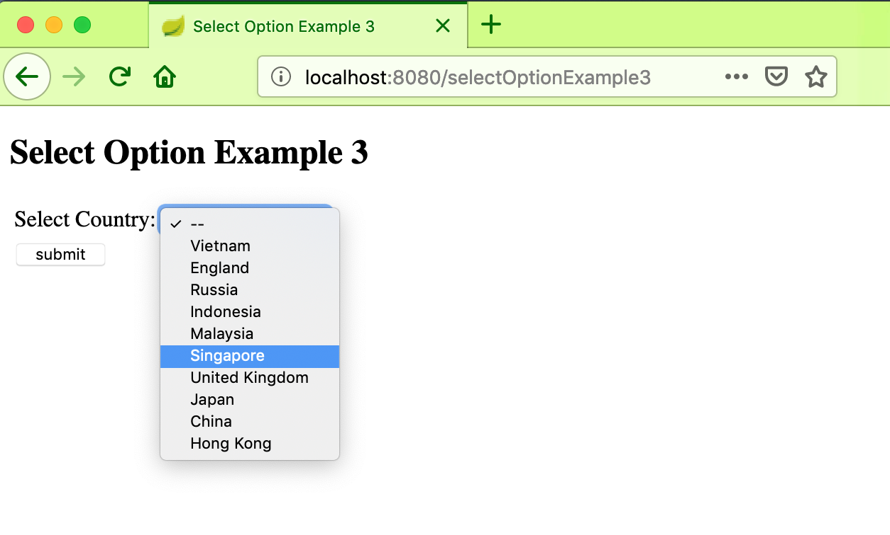

# springboot-dropdown-example2

### Run locally 

```
git clone https://github.com/hendisantika/springboot-dropdown-example2.git
```

```
mvn clean spring-boot:run
```

### Screen shot

Home Page



Dropdown Example 1 - Using List



Dropdown Example 2 - Using Map



Dropdown Example 3 - Using Map Key




